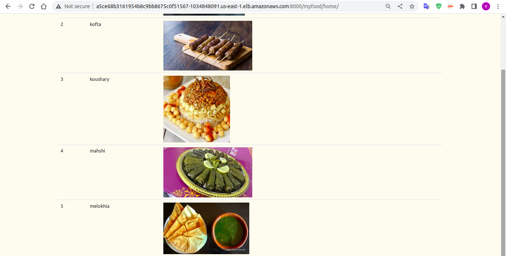
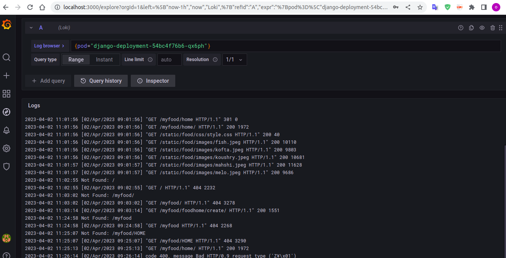

# Demo


## Brief
- Deploy a django webapp on kubernetes using helm chart.
- Monitoring django webapp logs using Loki and Promtail. 




## Pre-requisits:
* Setup K8s , I used eks on AWS using terrafrom to build my infrastructure on "AWS" [My infra repo ](https://github.com/matriix00/finalproject/tree/master/terraform)
   then create use terraform commands to build this infra.

* Install [Helm](https://helm.sh/docs/intro/install/) on your local machine.
* Install [kubectl](https://kubernetes.io/docs/tasks/tools/#kubectl) on your local machine to be able to run kubectl commands.

## Tools Used
<p align="center">
<a href="https://aws.amazon.com/" target="_blank" rel="noreferrer"> 

</a>
<a href="https://www.terraform.io/" target="_blank" rel="noreferrer">

</a>
<a href="https://kubernetes.io/" target="_blank" rel="noreferrer">

<a href="https://helm.sh/" target="_blank" rel="noreferrer">


<a href="https://grafana.com/oss/loki/" target="_blank" rel="noreferrer">

</a> 
</p>

## :rocket: Get started

### Cloning this project
```bash
$ git https://github.com/matriix00/django-webapp.git
```
* First we use helm to install (deploy) django chart on k8s .


```bash
$ helm install test django-chart/ --namespace django-namespace --create-namespace
```
* Now u can open you web app using loadbalancer url
```bash
kubectl get svc -n django-namespace
```
and add this to url

```bash
:8000/myfood/home/

```

* Second we use helm to install(deploy) grafana loki and grafan promtail charts .
```bash
$ helm upgrade --install loki grafana/loki-stack  --set grafana.enabled=true,prometheus.enabled=true,promtail.enabled=true
```

* Third we should get password to login into grafana
```bash
kubectl get secret loki-grafana -o jsonpath="{.data.admin-password}" | base64 --decode ; echo
```
To access the Grafana UI, run the following command:

```bash
kubectl port-forward service/loki-grafana 3000:80
```
* Now u can open grafana ui 

```bash
http://localhost:3000/
```


